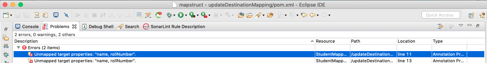
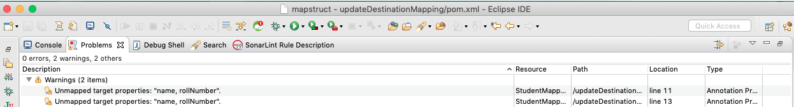
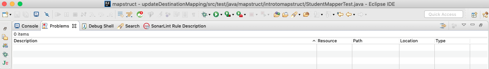

# MapStruct processor configuration

To understand MapStruct processor configuration first we need to see the default code generated by mapstruct without any custom property. 

Below one is the generated Mapper code without any custom property:

```java
/*
@Generated(
    value = "org.mapstruct.ap.MappingProcessor",
    date = "2020-06-03T16:41:51+0530",
    comments = "version: 1.3.1.Final, compiler: Eclipse JDT (IDE) 3.18.0.v20190522-0428, environment: Java 11.0.2 (Oracle Corporation)"
)
*/
public class StudentMapperImpl implements StudentMapper {

    @Override
    public StudentDTO convertStudentToStudentDTO(Student student) {
        if ( student == null ) {
            return null;
        }

        StudentDTO studentDTO = new StudentDTO();

        studentDTO.setFirstName( student.getName() );
        studentDTO.setEmail( student.getEmail() );
        studentDTO.setRollNumber( student.getRollNumber() );

        return studentDTO;
    }
}
```


In maven project processor configuration can be given in POM.xml file as below:

```xml
<plugin>
    <groupId>org.apache.maven.plugins</groupId>
    <artifactId>maven-compiler-plugin</artifactId>
    <version>3.6.2</version>
    <configuration>
        <source>11</source>
        <target>11</target>
        <annotationProcessorPaths>
            <path>
                <groupId>org.mapstruct</groupId>
                <artifactId>mapstruct-processor</artifactId>
                <version>1.3.1.Final</version>
            </path>
        </annotationProcessorPaths>
        <compilerArgs>
            <compilerArg>
		-Amapstruct.suppressGeneratorTimestamp=false
	    </compilerArg>
            <compilerArg>
		-Amapstruct.suppressGeneratorVersionInfoComment=false
	    </compilerArg>
	    <compilerArg>
		-Amapstruct.unmappedTargetPolicy=WARN
	    </compilerArg>
	    <compilerArg>
		-Amapstruct.defaultComponentModel=spring
	    </compilerArg>
        </compilerArgs>
    </configuration>
</plugin>
```
Please check the **compilerArgs**, where you can pass one or more custom configuration.

Now let's see all processor configuration property one by one:

- **mapstruct.suppressGeneratorTimestamp**: Default value is **false**, if set to **true** the date will be removed from  @Generated annotation in the generated mapper classes. [Sample code.](../examples/suppressGeneratorTimestamp)

  - *pom.xml Change*:
	```xml
	 <compilerArgs>
	    <compilerArg>
		    -Amapstruct.suppressGeneratorTimestamp=true
	    </compilerArg>
	 </compilerArgs>
	```
  - *Generated mapper class*:
	```java
	/*
	@Generated(
	    value = "org.mapstruct.ap.MappingProcessor",
	    comments = "version: 1.3.1.Final, compiler: Eclipse JDT (IDE) 3.18.0.v20190522-0428, environment: Java 11.0.2 (Oracle Corporation)"
	)
	*/
	public class StudentMapperImpl implements StudentMapper {

	    @Override
	    public StudentDTO convertStudentToStudentDTO(Student student) {
		if ( student == null ) {
		    return null;
		}

		StudentDTO studentDTO = new StudentDTO();

		studentDTO.setFirstName( student.getName() );
		studentDTO.setEmail( student.getEmail() );
		studentDTO.setRollNumber( student.getRollNumber() );

		return studentDTO;
	    }
	}
	```

- **mapstruct.suppressGeneratorVersionInfoComment**: Default value is **false**, if set to **true** the comments will be removed from  @Generated annotation in the generated mapper classes. The comment contains information about the version of MapStruct and about the compiler used for the annotation processing. [Sample code.](../examples/suppressGeneratorVersionInfoComment)


  - *pom.xml Change*:
	```xml
	 <compilerArgs>
	    <compilerArg>
		    -Amapstruct.suppressGeneratorVersionInfoComment=true
	    </compilerArg>
	 </compilerArgs>
	```
  - *Generated mapper class*:
	```java
	/*
	@Generated(
	    value = "org.mapstruct.ap.MappingProcessor",
	    date = "2020-06-03T17:05:37+0530"
	)
	*/
	public class StudentMapperImpl implements StudentMapper {

	    @Override
	    public StudentDTO convertStudentToStudentDTO(Student student) {
		if ( student == null ) {
		    return null;
		}

		StudentDTO studentDTO = new StudentDTO();

		studentDTO.setFirstName( student.getName() );
		studentDTO.setEmail( student.getEmail() );
		studentDTO.setRollNumber( student.getRollNumber() );

		return studentDTO;
	    }
	}
	```

- **mapstruct.unmappedTargetPolicy**: As name implies this property used to raise alarm if attribute of the target object is not populated with a source value on a mapping method.  Also unmappedTargetPolicy can be changed for an specific mapper useing @Mapper annotation, this takes precedence over common configuration.
  > @Mapper(unmappedTargetPolicy =  ReportingPolicy.IGNORE)
  
  [Sample code.](../examples/unmappedTargetPolicy)

  There are three values for this configuration:
  - **ERROR**: Any unmapped target property will cause the mapping code generation to fail
 
    - pom.xml Change:
	```xml
	 <compilerArgs>
	    <compilerArg>
		    -Amapstruct.unmappedTargetPolicy=ERROR
	    </compilerArg>
	 </compilerArgs>
	```
    - Mapping code will not generated and you can see below compilation error in eclispse problems window For code details check the sample project.
    	

  - **WARN**: Any unmapped target property will cause a warning at build time
 
    - pom.xml Change:
	```xml
	 <compilerArgs>
	    <compilerArg>
		    -Amapstruct.unmappedTargetPolicy=WARN
	    </compilerArg>
	 </compilerArgs>
	```
    - ***Mapping code will be generated and you can see below warnings eclispse problems window*** For code details check the sample project.
	

  - **IGNORE**: Unmapped target properties are ignored
 
    - pom.xml Change:
	```xml
	 <compilerArgs>
	    <compilerArg>
		    -Amapstruct.unmappedTargetPolicy=IGNORE
	    </compilerArg>
	 </compilerArgs>
	```
    - ***Mapping code will be generated and you will not see any issue/warning/error on eclispse problems window*** For code details check the sample project.
	

- **mapstruct.defaultComponentModel**: I think this is one the most important configuration which user wants to use as per their requirement. ComponentModel bascially tells compiler that how client wants to generate the class file, means whether it is simple implemention of the mapper interface or a spring class with @Component annotation so you can easily autowired the same in your project etc. Also defaultComponentModel can be changed for an specific mapper using @Mapper annotation, this takes precedence over common configuration.
  > @Mapper(componentModel = "spring")

  [Sample code.](../examples/componentModel)

  There are four values for this configuration:
  - **default**:  In this Mapper don't use any componentModel and generate simply implemention of the mapper interface.  Instance of this class can be retrieved through Mappers#getMapper(Class). For code details please check sample project.
 
    - pom.xml Change:
	```
	 For this configuration no change is required in POM and by default MapStruct pick this configuraiton with **default** value.
	```
    - Mapper interface:
	```java
	@Mapper
	public interface StudentMapper {

	 StudentMapper INSTANCE = Mappers.getMapper(StudentMapper.class);

	 void updateStudentDTO(Student student, @MappingTarget StudentDTO studentDTO);

	 StudentDTO updateAndRetrunStudentDTO(Student student, @MappingTarget StudentDTO studentDTO);
	}
	```
    INSTANCE can be used in any other file to use the mapping methods.


  - **spring**:  The generated mapper is a singleton-scoped Spring bean and can be retrieved via @Autowired.
 
    - pom.xml Change:
	```xml
	  <compilerArgs>
	    <compilerArg>
		    -Amapstruct.defaultComponentModel=spring
	    </compilerArg>
	 </compilerArgs>
	```
    - Generated mapper class:
	```java
	@Component
	public class StudentMapperImpl implements StudentMapper {

	    @Override
	    public StudentDTO convertStudentToStudentDTO(Student student) {
		if ( student == null ) {
		    return null;
		}

		StudentDTO studentDTO = new StudentDTO();

		studentDTO.setFirstName( student.getName() );
		studentDTO.setEmail( student.getEmail() );
		studentDTO.setRollNumber( student.getRollNumber() );

		return studentDTO;
	    }
	}
	```
    Just check the generated code, MapStruct added @Component on this class, so now you can easily autowired mapper interface anywhere in your project.

  - **cdi**: This is same as defaultComponentModel=spring and the generated mapper is an application-scoped CDI bean and can be retrieved via @Inject.
 
    - pom.xml Change:
	```xml
	  <compilerArgs>
	    <compilerArg>
		    -Amapstruct.defaultComponentModel=cdi
	    </compilerArg>
	 </compilerArgs>
	```

  - **jsr330**: The generated mapper is annotated with {@code @Named} and can be retrieved via @Inject, e.g. using Spring
 
    - pom.xml Change:
	```xml
	  <compilerArgs>
	    <compilerArg>
		    -Amapstruct.defaultComponentModel=jsr330
	    </compilerArg>
	 </compilerArgs>
	```
