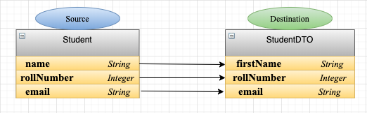

#### Mapping of source attribute to a different attribute name in destinaion object.

In MapStruct you can map a sourec attribute to any other attribute name with same data type in destion object.

